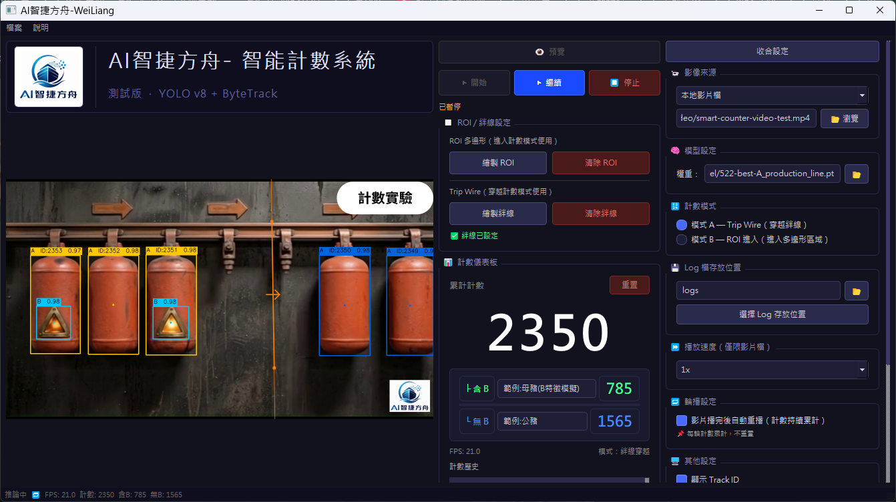

# AI智捷方舟智能計數系統



<p align="center">
  
</p>

<p align="center">
  <strong>基於 YOLOv8 + ByteTrack 的 AI 影像計數桌面系統</strong><br>
  支援本地影片、RTSP 串流、USB 攝影機、Trip Wire 穿越計數、ROI 進入計數、A/B 類別判斷、語音提示與 CSV 紀錄。
</p>

## 專案特色

- **AI 物件偵測**：使用 YOLOv8 模型進行 A / B 類別偵測。
- **穩定追蹤 ID**：整合 ByteTrack，並將 A 類別 ID 重新映射為連續顯示 ID。
- **兩種計數模式**：支援 Trip Wire 穿越計數與 ROI 進入計數。
- **A/B 分類統計**：計數 A 物件時，自動判斷 A 框內是否含有 B，分別累計「含 B」與「無 B」。
- **跨平台執行**：目前可於 Windows 11 與 Ubuntu 22.04 執行。
- **互動式 GUI**：使用 PyQt5 建立桌面操作介面，可直接設定來源、模型、ROI、絆線與信心值。
- **語音提示**：含 B 播放 `voice-wav/B.wav`，無 B 播放 `voice-wav/NO_B.wav`。
- **CSV 紀錄**：每次計數事件自動寫入 CSV，方便後續追蹤與分析。

## 執行環境

建議環境：

- Python 3.9+
- Windows 11 或 Ubuntu 22.04
- CUDA GPU 可加速推論，CPU 也可執行

安裝依賴：

```bash
pip install -r requirements.txt
```

主要套件：

```text
ultralytics>=8.2.0
opencv-python>=4.9.0
PyQt5>=5.15.0
numpy>=1.24.0
```

## 啟動方式

在專案根目錄執行：

```bash
python mainAPP.py
```

程式啟動後會載入 `settings.json`。模型與影片路徑已支援專案內相對路徑，因此搬移資料夾後仍可優先從下列資料夾尋找：

```text
PTmodel/
video/
voice-wav/
```

## 使用流程

1. 選擇影像來源：本地影片、RTSP 串流或 USB 攝影機。
2. 選擇 YOLO 模型權重，例如 `PTmodel/522-best-A_production_line.pt`。
3. 按下「預覽」，確認畫面可正常讀取。
4. 選擇計數模式：
   - 模式 A：Trip Wire 穿越計數
   - 模式 B：ROI 進入計數
5. 在畫面上繪製絆線或 ROI。
6. 設定物件框信心值、播放速度、是否輪播與是否啟用語音提示。
7. 按下「開始」，系統開始偵測、追蹤、計數與記錄。

## 計數邏輯

### Trip Wire 模式

系統會比較同一個 A 物件上一幀與目前幀的中心點，判斷是否跨越 Trip Wire。現行邏輯主要用於由左向右通過的場景。

### ROI Enter 模式

系統會判斷 A 物件中心點是否進入使用者繪製的 ROI 多邊形區域。當尚未計數的追蹤 ID 進入 ROI 時，新增一筆計數事件。

### 含 B / 無 B 判斷

當 A 觸發計數時，系統會檢查是否有 B 物件中心點落在該 A 的 BBox 內：

- 有 B：總計數 +1，含 B 計數 +1，播放 `voice-wav/B.wav`
- 無 B：總計數 +1，無 B 計數 +1，播放 `voice-wav/NO_B.wav`

## 輸出資料

CSV 預設輸出至：

```text
logs/
```

檔名格式：

```text
count_YYYYMMDD_HHMMSS.csv
```

欄位包含：

| 欄位 | 說明 |
| --- | --- |
| `count` | A 物件累計總數 |
| `track_id` | A 物件顯示用追蹤 ID |
| `datetime` | 計數事件時間 |
| `mode` | 計數模式 |
| `has_b` | 是否含 B |
| `count_with_b` | 含 B 累計數 |
| `count_no_b` | 無 B 累計數 |

## 專案結構

```text
smart-counter-v2/
├─ mainAPP.py                  # 程式入口
├─ config.py                   # 全域設定與 AppSettings
├─ settings.json               # GUI 設定檔
├─ requirements.txt            # Python 依賴
├─ 教學檔案.html                # HTML 使用說明頁
├─ PTmodel/                    # YOLO 模型權重
├─ video/                      # 測試影片
├─ voice-wav/                  # 語音提示音檔
├─ logs/                       # CSV 與重置紀錄輸出
├─ core/
│  ├─ video_source.py          # 影片 / RTSP / USB 來源封裝
│  ├─ inference.py             # YOLOv8 + ByteTrack 推論
│  ├─ counter.py               # Trip Wire / ROI 計數邏輯
│  └─ csv_logger.py            # CSV 事件紀錄
└─ gui/
   ├─ main_window.py           # 主視窗與執行緒管理
   ├─ control_panel.py         # 控制面板
   ├─ video_widget.py          # 影像顯示與繪製
   ├─ roi_editor.py            # ROI / 絆線設定面板
   └─ dashboard.py             # 計數儀表板
```

## HTML 說明文件

專案內提供完整 HTML 教學頁：

```text
教學檔案.html
```

可直接用瀏覽器開啟，內容包含系統介紹、安裝啟動、操作流程、設定說明、輸出資料與疑難排解。

## 注意事項

- 若模型類別名稱不是 `A` / `B`，請同步修改 `config.py` 中的 `TARGET_CLASS_NAME` 與 `TARGET_CLASS_B_NAME`。
- 若未偵測到物件，可嘗試降低「物件框信心值」。
- 若誤判偏多，可提高「物件框信心值」。
- RTSP 使用時請確認 OpenCV / FFmpeg 支援與網路連線狀態。
- `logs/` 為執行輸出資料夾，已由 `.gitignore` 排除，不會上傳到 GitHub。

## 使用聲明

本專案目前主要作為研究、教學與技術展示用途，內容包含 AI 影像辨識、物件追蹤、工業計數流程與 PyQt5 桌面介面整合範例。

若需用於正式商業部署、量產環境或第三方散布，請先確認模型權重、資料集、影音素材與相關依賴套件的授權條款，並依實際使用情境補充正式 License 與責任聲明。
